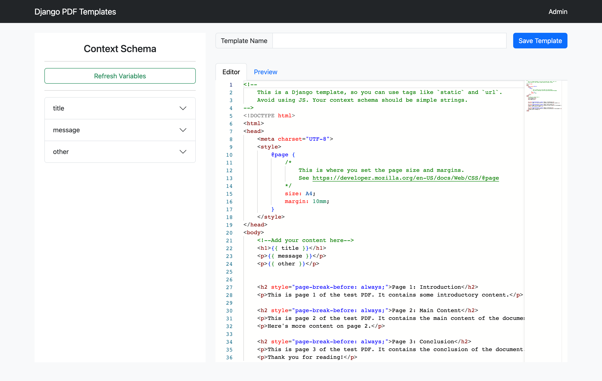

# django-pdf

## Overview
- `django-pdf` is a Django package for automating the generation of documents. From contracts to invoices, this package lets you turn your templates into PDFs programmatically.
- WIP

## Screenshots



## Features
- Create documents from existing PDF and HTML templates
- Easy-to-use API
- Compatible with Django models
- Secure and scalable

## Installation
* NB this is only work when V1 is released

Install using pip:<br>
```pip install django-pdf``` 

### settings.py

Add it to your INSTALLED_APPS:
```
INSTALLED_APPS = [
    # ...
    'django_pdf',
    # ...
]
```

### urls.py

Add this to your main urls list:

```
path('pdf/', include('django_pdf.urls', namespace="django_pdf")),
```

## Notes
- Still WIP, has not been released yet